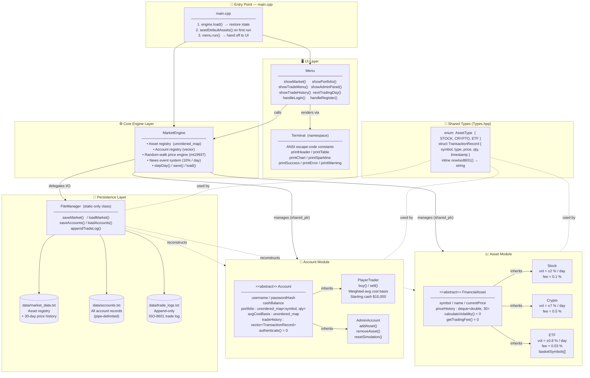

# 系統架構圖 / System Architecture Diagram

> **Terminal Stock Exchange (TSE)** — C++17 互動式終端股票交易模擬系統

This diagram shows how the five architectural layers of the TSE interact with each other at runtime.

---

## 架構總覽 / Architecture Overview

---

## Layer Responsibilities

| Layer | Files | Responsibility |
|-------|-------|---------------|
| **Entry Point** | `src/main.cpp` | Bootstrap: load state → seed defaults → start menu loop |
| **Core Engine** | `src/engine/MarketEngine.hpp/.cpp` | Central registry, random-walk simulation, news events, persistence delegation |
| **Asset Module** | `src/assets/` | OOP hierarchy for all tradeable instruments; polymorphic volatility and fee logic |
| **Account Module** | `src/accounts/` | OOP hierarchy for all user types; buy/sell execution, cost-basis tracking |
| **Persistence Layer** | `src/io/FileManager.hpp/.cpp` | Static I/O service; pipe-delimited text serialisation/deserialisation |
| **UI Layer** | `src/ui/Terminal.hpp/.cpp`, `src/ui/Menu.hpp/.cpp` | ANSI rendering utilities + interactive menu loop |
| **Shared Types** | `src/types/Types.hpp` | Cross-cutting enum, struct, and utility function |

---

## Key Design Decisions

- **`shared_ptr` throughout** — assets and accounts are heap-allocated and owned by `MarketEngine` via `shared_ptr`; other components hold non-owning references.
- **Static-only `FileManager`** — no instance needed; all methods are `static`, preventing accidental state in the I/O layer.
- **`namespace Terminal`** — renders the UI layer as a collection of stateless free functions rather than a class, keeping it lightweight.
- **`mt19937` PRNG** — seeded from `std::random_device` on `MarketEngine` construction for reproducible-but-varied daily price moves.

---

*See also: [CLASS_DIAGRAM.md](CLASS_DIAGRAM.md) · [DATA_FLOW.md](DATA_FLOW.md) · [README.md](README.md)*
