```mermaid
classDiagram
    %% ─── Shared Types ───────────────────────────────────────────────────────
    class AssetType {
        <<enumeration>>
        STOCK
        CRYPTO
        ETF
    }

    class TransactionRecord {
        <<struct>>
        +string symbol
        +string type
        +double price
        +int quantity
        +string timestamp
    }

    %% ─── Asset Hierarchy ─────────────────────────────────────────────────────
    class FinancialAsset {
        <<abstract>>
        #string symbol
        #string name
        #double currentPrice
        #deque~double~ priceHistory
        #AssetType assetType
        #MAX_HISTORY$ = 30
        +FinancialAsset(sym, name, price, type)
        +calculateVolatility()* double
        +getTradingFee()* double
        +updatePrice(double) void
        +display() void
        +getSymbol() string
        +getName() string
        +getCurrentPrice() double
        +getPriceHistory() deque~double~
        +getAssetType() AssetType
    }

    class Stock {
        -double volatilityFactor
        -double dividendYield
        +Stock(sym, name, price, vol, div)
        +calculateVolatility() double
        +getTradingFee() double
        +getVolatilityFactor() double
        +getDividendYield() double
    }

    class Crypto {
        -double volatilityFactor
        -double tradingFeeRate
        -bool tradesAroundClock
        +Crypto(sym, name, price, vol, fee)
        +calculateVolatility() double
        +getTradingFee() double
        +getVolatilityFactor() double
        +getTradingFeeRate() double
        +isAroundClock() bool
    }

    class ETF {
        -double volatilityFactor
        -vector~string~ basketSymbols
        +ETF(sym, name, price, basket, vol)
        +calculateVolatility() double
        +getTradingFee() double
        +getVolatilityFactor() double
        +getBasketSymbols() vector~string~
    }

    %% ─── Account Hierarchy ───────────────────────────────────────────────────
    class Account {
        <<abstract>>
        #string username
        #string passwordHash
        #double cashBalance
        #unordered_map~string,int~ portfolio
        #vector~TransactionRecord~ tradeHistory
        #unordered_map~string,double~ avgCostBasis
        #hashPassword(string)$ string
        #updateCostBasis(sym, qty, cost) void
        +Account(user, password, cash)
        +authenticate(password)* bool
        +getAccountType()* string
        +getUsername() string
        +getCashBalance() double
        +getPasswordHash() string
        +getPortfolio() map
        +getTradeHistory() vector
        +getAvgCostBasis() map
        +setCashBalance(double) void
        +modifyCash(double) void
        +setPortfolio(map) void
        +addTradeRecord(TransactionRecord) void
        +setAvgCostBasis(map) void
        +setPasswordHashDirect(string) void
    }

    class PlayerTrader {
        +PlayerTrader(user, pass, cash=10000)
        +authenticate(password) bool
        +getAccountType() string
        +buy(sym, qty, price, fee) bool
        +sell(sym, qty, price, fee) bool
    }

    class AdminAccount {
        +AdminAccount(user, password)
        +authenticate(password) bool
        +getAccountType() string
        +addAsset(shared_ptr~FinancialAsset~) void
        +removeAsset(symbol) void
        +resetSimulation() void
    }

    %% ─── Engine ──────────────────────────────────────────────────────────────
    class MarketEngine {
        -unordered_map~string,shared_ptr~FinancialAsset~~ assets
        -vector~shared_ptr~Account~~ accounts
        -shared_ptr~Account~ currentUser
        -mt19937 rng
        -int currentDay
        -NEWS_PROBABILITY$ = 0.10
        -NEWS_SPIKE_MIN$ = 0.15
        -NEWS_SPIKE_MAX$ = 0.40
        -applyNewsEvent() void
        +MarketEngine()
        +addAsset(shared_ptr) void
        +removeAsset(symbol) void
        +clearAssets() void
        +getAsset(symbol) shared_ptr~FinancialAsset~
        +getAssets() map
        +listAssets() void
        +registerAccount(shared_ptr) void
        +findAccount(username) shared_ptr~Account~
        +getAccounts() vector
        +accountExists(username) bool
        +setCurrentUser(shared_ptr) void
        +getCurrentUser() shared_ptr~Account~
        +getCurrentDay() int
        +setCurrentDay(int) void
        +stepDay() void
        +seedDefaultAssets() void
        +save() bool
        +load() bool
    }

    %% ─── I/O ─────────────────────────────────────────────────────────────────
    class FileManager {
        <<static>>
        -DATA_DIR$ = "data"
        -MARKET_FILE$ = "data/market_data.txt"
        -ACCOUNTS_FILE$ = "data/accounts.txt"
        -TRADE_LOG_FILE$ = "data/trade_logs.txt"
        +ensureDataDir()$ void
        +saveMarket(MarketEngine)$ bool
        +loadMarket(MarketEngine)$ bool
        +saveAccounts(vector)$ bool
        +loadAccounts()$ vector~shared_ptr~Account~~
        +appendTradeLog(record, username)$ bool
    }

    %% ─── UI ──────────────────────────────────────────────────────────────────
    class Terminal {
        <<namespace>>
        +RESET, BOLD, DIM, ITALIC
        +GREEN, RED, YELLOW, CYAN
        +WHITE, MAGENTA
        +BRIGHT_GREEN, BRIGHT_RED
        +BRIGHT_CYAN, BRIGHT_YELLOW, BRIGHT_MAGENTA
        +BOX_WIDTH$ = 62
        +clearScreen()$
        +printSplash()$
        +printHeader(title)$
        +printDivider(width)$
        +printTable(headers, rows, colWidth)$
        +printColored(text, color)$
        +printChart(history)$
        +printSparkline(history, width) string$
        +sparklineColor(history) const_char*$
        +printSuccess(msg)$
        +printError(msg)$
        +printWarning(msg)$
    }

    class Menu {
        -MarketEngine engine
        -bool running
        +Menu(MarketEngine)
        +run() void
        -showMarket() void
        -showPortfolio() void
        -showTradeMenu() void
        -showAdminPanel() void
        -showTradeHistory() void
        -nextTradingDay() void
        -handleLogin() void
        -handleRegister() void
        -handleLogout() void
        -viewAsset(symbol) void
        -promptBuy(symbol) void
        -promptSell(symbol) void
        -getMenuChoice(min, max) int
        -waitForEnter() void
    }

    %% ─── Inheritance ─────────────────────────────────────────────────────────
    FinancialAsset <|-- Stock      : inherits
    FinancialAsset <|-- Crypto     : inherits
    FinancialAsset <|-- ETF        : inherits

    Account        <|-- PlayerTrader  : inherits
    Account        <|-- AdminAccount  : inherits

    %% ─── Composition / Aggregation ───────────────────────────────────────────
    MarketEngine "1" o-- "0..*" FinancialAsset : aggregates
    MarketEngine "1" o-- "0..*" Account        : aggregates
    MarketEngine "1" --> "0..1" Account        : currentUser

    Account "1" *-- "0..*" TransactionRecord  : contains

    %% ─── Dependencies ────────────────────────────────────────────────────────
    MarketEngine  -->  FileManager : delegates I/O
    Menu          -->  MarketEngine : holds reference
    Menu          ..>  Terminal    : calls for rendering
    FileManager   ..>  MarketEngine : reads / writes
    FileManager   ..>  Account     : reconstructs

    FinancialAsset --> AssetType   : uses
    Account        --> TransactionRecord : records trades
```

# 類別關係圖 / Class Relationship Diagram

> **Terminal Stock Exchange (TSE)** — Complete UML class diagram showing all classes, their members, and their relationships.

---



---

## Relationship Key

| Symbol | Meaning |
|--------|---------|
| `<\|--` | Inheritance (IS-A) |
| `o--` | Aggregation — `MarketEngine` owns assets/accounts via `shared_ptr`; objects can exist independently |
| `*--` | Composition — `TransactionRecord`s live inside an `Account` and are destroyed with it |
| `-->` | Association — one class holds a reference or pointer to another |
| `..>` | Dependency — one class uses another (e.g. passes it as a parameter) |

---

## Inheritance Hierarchies

### Asset Hierarchy

```
FinancialAsset  (abstract — pure virtual: calculateVolatility(), getTradingFee())
├── Stock       vol ±2%/day  │ fee 0.1%  │ dividendYield
├── Crypto      vol ±7%/day  │ fee 0.5%  │ tradesAroundClock = true
└── ETF         vol ±0.8%/day│ fee 0.03% │ basketSymbols[]
```

### Account Hierarchy

```
Account  (abstract — pure virtual: authenticate(), getAccountType())
├── PlayerTrader   buy() / sell()  │ weighted-avg cost basis │ $10,000 start
└── AdminAccount   addAsset() / removeAsset() / resetSimulation()
```

---

*See also: [ARCHITECTURE.md](ARCHITECTURE.md) · [DATA_FLOW.md](DATA_FLOW.md) · [README.md](README.md)*
