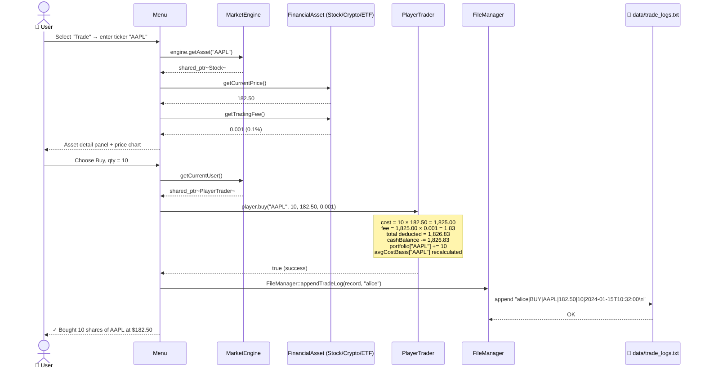
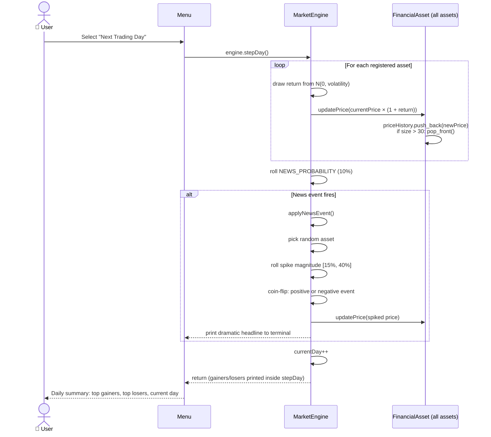
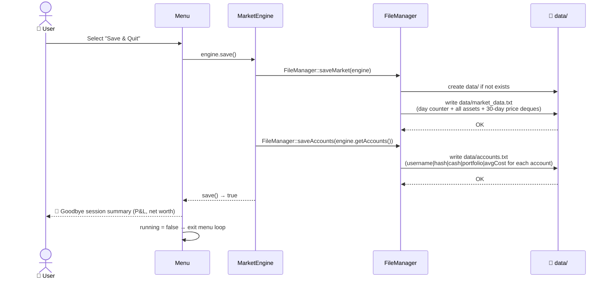

# 資料流程圖 / Data Flow Diagram

> **Terminal Stock Exchange (TSE)** — Sequence diagrams showing how data moves through the system for the three core runtime flows.

---

## Flow 1: Startup & State Restoration

```mermaid
sequenceDiagram
    actor User as 👤 User
    participant main as main.cpp
    participant ME as MarketEngine
    participant FM as FileManager
    participant Disk as 💾 data/

    User->>main: ./build/tse
    main->>ME: MarketEngine engine
    main->>ME: engine.load()
    ME->>FM: FileManager::loadMarket(engine)
    FM->>Disk: open data/market_data.txt
    alt File exists
        Disk-->>FM: pipe-delimited asset records + day counter
        FM-->>ME: restore assets, setCurrentDay(n)
        ME->>FM: FileManager::loadAccounts()
        FM->>Disk: open data/accounts.txt
        Disk-->>FM: pipe-delimited account records
        FM-->>ME: registerAccount(PlayerTrader / AdminAccount)
        ME-->>main: load() → true
    else First run (no data/)
        Disk-->>FM: file not found
        FM-->>ME: load() → false
        ME-->>main: load() → false
        main->>ME: engine.seedDefaultAssets()
        Note over ME: Seeds 10 default assets<br/>+ admin account (admin/admin)
    end
    main->>Menu: Menu menu(engine); menu.run()
    Menu-->>User: Splash screen → Login/Register prompt
```

---

## Flow 2: Trade Execution (Buy)



---

## Flow 3: Advance Trading Day



---

## Flow 4: Save & Quit



---

## Data File Formats

### `data/market_data.txt`
```
DAY|5
STOCK|AAPL|Apple Inc.|182.50|0.02|0.0|180.10|181.30|182.50|...
CRYPTO|BTC|Bitcoin|43250.00|0.07|0.005|41000.00|42100.00|43250.00|...
ETF|SPY|S&P 500 ETF|452.10|0.008|SPY:AAPL:MSFT:GOOGL|450.20|451.60|452.10|...
```

### `data/accounts.txt`
```
PLAYER|alice|12345678901234567890|9823.17|AAPL:10:182.50,MSFT:5:370.00|
ADMIN|admin|98765432109876543210|0.00||
```

### `data/trade_logs.txt`
```
alice|BUY|AAPL|182.50|10|2024-01-15T10:32:00
alice|SELL|BTC|43100.00|1|2024-01-15T14:05:22
```

---

*See also: [ARCHITECTURE.md](ARCHITECTURE.md) · [CLASS_DIAGRAM.md](CLASS_DIAGRAM.md) · [README.md](README.md)*
