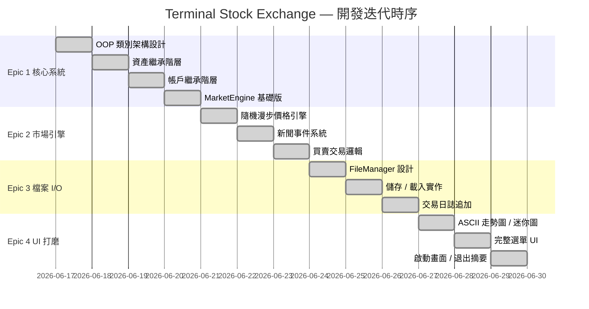
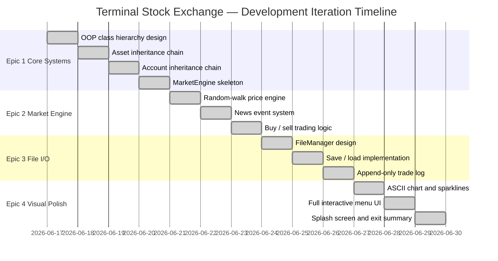

# 開發規格說明與迭代流程 / Development Specification & Iteration History

> **Terminal Stock Exchange (TSE)** — C++17 互動式終端股票交易模擬系統

---

## 目錄 / Table of Contents

- [中文說明](#中文說明)
- [English Documentation](#english-documentation)

---

# 中文說明

## 一、系統規格說明

### 1.1 資產類型規格

| 資產類型 | 類別名稱 | 日波動率 (σ) | 手續費率 | 特殊屬性 |
|---------|---------|-------------|---------|---------|
| 股票 | `Stock` | ±2% / 日 | 0.1% | `dividendYield` (股息率) |
| 加密貨幣 | `Crypto` | ±7% / 日 | 0.5% | `tradesAroundClock = true` (24/7) |
| ETF | `ETF` | ±0.8% / 日 | 0.03% | `basketSymbols[]` (成分股清單) |

**預設上市資產（共 10 檔）：**

| 代號 | 名稱 | 類型 | 初始價格 |
|------|------|------|---------|
| AAPL | Apple Inc. | Stock | $182.50 |
| MSFT | Microsoft Corp. | Stock | $374.20 |
| GOOGL | Alphabet Inc. | Stock | $140.10 |
| TSLA | Tesla Inc. | Stock | $245.80 |
| NVDA | NVIDIA Corp. | Stock | $495.30 |
| SPY | S&P 500 ETF | ETF | $452.10 |
| QQQ | Nasdaq-100 ETF | ETF | $378.60 |
| BTC | Bitcoin | Crypto | $43,250.00 |
| ETH | Ethereum | Crypto | $2,285.00 |
| SOL | Solana | Crypto | $98.40 |

---

### 1.2 價格更新演算法（隨機漫步）

每呼叫一次 `MarketEngine::stepDay()`，每個資產的價格依照以下公式更新：

```
新價格 = 目前價格 × (1 + r)

其中 r ~ N(0, σ)，即從均值為 0、標準差為 σ 的常態分布取樣
σ = calculateVolatility()（依資產類型而定）
```

**實作細節：**
- 使用 `std::mt19937`（Mersenne Twister 64 位元 PRNG），以 `std::random_device` 作為種子
- 使用 `std::normal_distribution<double>(0.0, volatility)` 取樣每日報酬率
- 價格歷史以 `std::deque<double>` 儲存，上限為 30 筆（超出則自動刪除最舊一筆）

---

### 1.3 新聞事件系統規格

| 參數 | 數值 |
|------|------|
| 觸發機率 | 10%（每個交易日） |
| 最小事件幅度 | ±15% |
| 最大事件幅度 | ±40% |
| 事件對象 | 隨機選取一個已上市資產 |
| 事件方向 | 以 50% 機率決定正面或負面 |

**正面新聞模板（8 種）：** 例如「季度財報大幅超越預期 — 分析師升評至買入！」  
**負面新聞模板（8 種）：** 例如「CEO 突然辭職、爆發會計醜聞！」

---

### 1.4 交易執行規格

**買入計算：**
```
交易總成本 = 數量 × 單價 × (1 + 手續費率)
扣款來源   = 帳戶現金餘額
加權平均成本更新公式：
  新平均成本 = (原有股數 × 原平均成本 + 買入股數 × 買入單價)
               ÷ (原有股數 + 買入股數)
```

**賣出計算：**
```
實收金額 = 數量 × 單價 × (1 - 手續費率)
實現損益 = (賣出單價 - 平均成本) × 數量 - 手續費
```

**失敗條件：**
- 買入時：現金不足
- 賣出時：持倉不足

---

### 1.5 帳戶系統規格

| 屬性 | 規格 |
|------|------|
| 初始資金 | $10,000 USD（`PlayerTrader` 預設值） |
| 密碼儲存 | `std::hash<std::string>` 雜湊後以字串儲存 |
| 投資組合 | `std::unordered_map<string, int>` — 代號對應持倉數量 |
| 平均成本 | `std::unordered_map<string, double>` — 代號對應加權平均成本 |
| 交易歷史 | `std::vector<TransactionRecord>` — ISO-8601 時間戳記 |
| 預設管理員 | 帳號：`admin` / 密碼：`admin`（首次啟動自動建立） |

---

### 1.6 資料檔案格式規格

**`data/market_data.txt`（管線分隔）：**
```
DAY|<模擬天數>
STOCK|<代號>|<名稱>|<目前價格>|<波動率>|<股息率>|<歷史價格1>|<歷史價格2>|...
CRYPTO|<代號>|<名稱>|<目前價格>|<波動率>|<手續費率>|<歷史價格1>|...
ETF|<代號>|<名稱>|<目前價格>|<波動率>|<成分股代號:代號:...>|<歷史價格1>|...
```

**`data/accounts.txt`（管線分隔）：**
```
PLAYER|<帳號>|<密碼雜湊>|<現金餘額>|<代號:數量,代號:數量,...>|<代號:均價,代號:均價,...>
ADMIN|<帳號>|<密碼雜湊>|<現金餘額>||
```

**`data/trade_logs.txt`（追加式，管線分隔）：**
```
<帳號>|<操作:BUY/SELL>|<代號>|<單價>|<數量>|<ISO-8601時間戳記>
```

---

## 二、開發迭代流程

本專案採用 **Epic（史詩需求）** 模式進行迭代開發，共分四個階段：

---

### Epic 1 — 核心系統建構（Core Systems）

**目標：** 建立所有 OOP 類別架構，不含實際業務邏輯。

**完成項目：**
- 建立 `Types.hpp`：定義 `AssetType` 列舉、`TransactionRecord` 結構、`nowIso8601()` 工具函式
- 建立 `FinancialAsset`（抽象基底類別）：包含 `priceHistory`（`std::deque<double>`，上限 30）、純虛函式 `calculateVolatility()` 與 `getTradingFee()`
- 建立三個衍生資產類別：`Stock`、`Crypto`、`ETF`，各自覆寫波動率與手續費
- 建立 `Account`（抽象基底類別）：包含 `portfolio`（`unordered_map`）、`tradeHistory`（`vector`）、`avgCostBasis`（`unordered_map`）
- 建立兩個衍生帳戶類別：`PlayerTrader`（玩家）、`AdminAccount`（管理員）
- 建立 `MarketEngine`：資產登錄表（`unordered_map`），含 `addAsset()`、`removeAsset()`、`getAsset()`
- 建立基本 `CMakeLists.txt`：C++17、`-Wall -Wextra -O2`

**新增檔案：**
`Types.hpp`、`FinancialAsset.hpp`、`Stock.hpp/.cpp`、`Crypto.hpp/.cpp`、`ETF.hpp/.cpp`、`Account.hpp`、`PlayerTrader.hpp/.cpp`、`AdminAccount.hpp/.cpp`、`MarketEngine.hpp/.cpp`（基礎版）、`CMakeLists.txt`

---

### Epic 2 — 市場引擎與交易系統（Market Engine & Trading）

**目標：** 實作隨機漫步價格引擎、新聞事件系統、玩家買賣交易邏輯，以及基本終端機選單。

**完成項目：**
- `MarketEngine::stepDay()`：以 `std::mt19937` + `std::normal_distribution` 實作每日隨機漫步
- 新聞事件系統：10% 機率觸發 ±15%~40% 的大幅價格波動，並印出戲劇性標題
- `PlayerTrader::buy()` / `sell()`：實作加權平均成本計算、現金扣款、手續費收取
- `MarketEngine` 新增帳戶登錄表：`registerAccount()`、`findAccount()`、`accountExists()`
- `MarketEngine::seedDefaultAssets()`：種植 10 檔預設資產
- 建立基本 `Terminal` namespace 與 `Menu` 類別（互動式選單迴圈）

**新增 / 修改檔案：**
`MarketEngine.hpp/.cpp`（大幅擴充）、`PlayerTrader.cpp`（交易邏輯）、`Terminal.hpp/.cpp`（基礎版）、`Menu.hpp/.cpp`（基礎版）

---

### Epic 3 — 檔案 I/O 與全狀態持久化（File I/O & Persistence）

**目標：** 實作完整的儲存/載入功能，使所有遊戲進度能在重啟後還原。

**完成項目：**
- 建立 `FileManager`（純靜態類別）：實作 `saveMarket()`、`loadMarket()`、`saveAccounts()`、`loadAccounts()`、`appendTradeLog()`
- `FileManager::ensureDataDir()`：自動建立 `data/` 目錄
- 管線分隔文字格式（pipe-delimited）：定義三個資料檔案的完整語法
- `MarketEngine::save()` / `load()`：委派給 `FileManager`
- `PlayerTrader::buy()` / `sell()`：交易完成後即時呼叫 `FileManager::appendTradeLog()`
- `main.cpp` 更新：啟動時嘗試 `engine.load()`，失敗則種植預設資料
- `Menu::handleRegister()`：新帳戶即時加入登錄表並自動登入

**新增 / 修改檔案：**
`FileManager.hpp/.cpp`（全新）、`MarketEngine.cpp`（save/load）、`PlayerTrader.cpp`（交易日誌）、`main.cpp`（啟動序列）、`Menu.cpp`（登入/登出/存檔）

---

### Epic 4 — 視覺美化與使用者體驗打磨（Visual Polish & UX）

**目標：** 大幅提升終端機介面的視覺品質，實作所有剩餘的 UI 功能。

**完成項目：**
- `Terminal::printSplash()`：ASCII 藝術啟動畫面
- `Terminal::printSparkline()`：UTF-8 方塊字元走勢迷你圖（`▁▂▃▄▅▆▇█`）
- `Terminal::printChart()`：30 天完整 ASCII 折線圖（漲綠跌紅）
- `Terminal::sparklineColor()`：依漲跌自動套用 `BRIGHT_GREEN` / `BRIGHT_RED`
- 新增 ANSI 代碼：`BRIGHT_YELLOW`（淨值高亮）、`BRIGHT_MAGENTA`（管理員標章）、`ITALIC`
- `Menu::showTradeHistory()`：顯示 ISO-8601 時間戳記的完整交易紀錄
- `Menu::handleLogout()`：儲存狀態並返回登入畫面（非退出程式）
- 退出畫面：顯示本次交易摘要（總損益、淨值）

**新增 / 修改檔案：**
`Terminal.hpp/.cpp`（全面強化）、`Menu.cpp`（所有 UI 功能）

---

## 三、開發時序表



---

---

# English Documentation

## I. System Specification

### 1.1 Asset Type Specifications

| Asset Type | Class | Daily Volatility (σ) | Fee Rate | Special Property |
|-----------|-------|---------------------|----------|-----------------|
| Stock | `Stock` | ±2% / day | 0.1% | `dividendYield` |
| Cryptocurrency | `Crypto` | ±7% / day | 0.5% | `tradesAroundClock = true` (24/7) |
| ETF | `ETF` | ±0.8% / day | 0.03% | `basketSymbols[]` (constituent list) |

**Default Listed Assets (10 total):**

| Symbol | Name | Type | Starting Price |
|--------|------|------|---------------|
| AAPL | Apple Inc. | Stock | $182.50 |
| MSFT | Microsoft Corp. | Stock | $374.20 |
| GOOGL | Alphabet Inc. | Stock | $140.10 |
| TSLA | Tesla Inc. | Stock | $245.80 |
| NVDA | NVIDIA Corp. | Stock | $495.30 |
| SPY | S&P 500 ETF | ETF | $452.10 |
| QQQ | Nasdaq-100 ETF | ETF | $378.60 |
| BTC | Bitcoin | Crypto | $43,250.00 |
| ETH | Ethereum | Crypto | $2,285.00 |
| SOL | Solana | Crypto | $98.40 |

---

### 1.2 Price Update Algorithm (Random Walk)

Each call to `MarketEngine::stepDay()` updates every asset price using the following formula:

```
new_price = current_price × (1 + r)

where r ~ N(0, σ)  — sampled from a normal distribution with mean 0 and std-dev σ
and   σ = asset.calculateVolatility()  (varies by asset type)
```

**Implementation details:**
- `std::mt19937` (Mersenne Twister PRNG) seeded from `std::random_device` at engine construction
- `std::normal_distribution<double>(0.0, volatility)` samples each day's return
- Price history stored in `std::deque<double>` capped at 30 entries (oldest evicted on overflow)

---

### 1.3 News Event System

| Parameter | Value |
|-----------|-------|
| Trigger probability | 10% per trading day |
| Minimum event magnitude | ±15% |
| Maximum event magnitude | ±40% |
| Target selection | One randomly chosen listed asset |
| Direction | 50% positive / 50% negative |

**8 positive headline templates** — e.g. *"BEATS quarterly earnings by 20% — Analysts upgrade to BUY!"*  
**8 negative headline templates** — e.g. *"CEO resigns unexpectedly amid accounting scandal!"*

---

### 1.4 Trade Execution Specification

**Buy calculation:**
```
total_cost        = quantity × price × (1 + fee_rate)
deducted_from     = account.cashBalance
new_avg_cost      = (old_qty × old_avg + buy_qty × buy_price) ÷ (old_qty + buy_qty)
```

**Sell calculation:**
```
proceeds          = quantity × price × (1 - fee_rate)
credited_to       = account.cashBalance
```

**Failure conditions:**
- Buy: insufficient cash balance
- Sell: insufficient holdings in portfolio

---

### 1.5 Account System Specification

| Property | Specification |
|----------|--------------|
| Starting cash | $10,000 USD (`PlayerTrader` default) |
| Password storage | `std::hash<std::string>` stored as decimal string |
| Portfolio | `std::unordered_map<string, int>` — symbol → quantity held |
| Cost basis | `std::unordered_map<string, double>` — symbol → weighted-avg cost |
| Trade history | `std::vector<TransactionRecord>` — ISO-8601 timestamps |
| Default admin | username: `admin` / password: `admin` (auto-seeded on first run) |

---

### 1.6 Data File Format Specification

**`data/market_data.txt` (pipe-delimited):**
```
DAY|<simulation_day>
STOCK|<symbol>|<name>|<price>|<volatility>|<dividend_yield>|<hist1>|<hist2>|...
CRYPTO|<symbol>|<name>|<price>|<volatility>|<fee_rate>|<hist1>|...
ETF|<symbol>|<name>|<price>|<volatility>|<sym1:sym2:sym3>|<hist1>|...
```

**`data/accounts.txt` (pipe-delimited):**
```
PLAYER|<username>|<password_hash>|<cash>|<sym:qty,sym:qty,...>|<sym:avg,sym:avg,...>
ADMIN|<username>|<password_hash>|<cash>||
```

**`data/trade_logs.txt` (append-only, pipe-delimited):**
```
<username>|<BUY|SELL>|<symbol>|<price>|<quantity>|<ISO-8601_timestamp>
```

---

## II. Development Iteration History

This project was built using an **Epic-driven iterative development** model across four phases, with each Epic adding a complete vertical slice of functionality.

---

### Epic 1 — Core Systems

**Goal:** Establish the complete OOP class hierarchy with correct inheritance chains. No business logic yet — pure structural scaffolding.

**Completed:**
- `Types.hpp`: `AssetType` enum, `TransactionRecord` struct, `nowIso8601()` helper
- `FinancialAsset` (ABC): `priceHistory` as `std::deque<double>` (max 30); pure-virtual `calculateVolatility()` and `getTradingFee()`
- `Stock`, `Crypto`, `ETF`: derive from `FinancialAsset`; each overrides volatility and fee with asset-class-appropriate constants
- `Account` (ABC): `portfolio` (`unordered_map`), `tradeHistory` (`vector`), `avgCostBasis` (`unordered_map`); pure-virtual `authenticate()` and `getAccountType()`
- `PlayerTrader`, `AdminAccount`: derive from `Account`
- `MarketEngine` (skeleton): asset registry via `unordered_map`; `addAsset()`, `getAsset()`, `listAssets()`
- `CMakeLists.txt`: C++17 standard, `-Wall -Wextra -O2`

**Files added:**  
`Types.hpp`, `FinancialAsset.hpp`, `Stock.hpp/.cpp`, `Crypto.hpp/.cpp`, `ETF.hpp/.cpp`, `Account.hpp`, `PlayerTrader.hpp/.cpp`, `AdminAccount.hpp/.cpp`, `MarketEngine.hpp/.cpp` (skeleton), `CMakeLists.txt`

---

### Epic 2 — Market Engine & Trading System

**Goal:** Bring the simulation to life with a working price engine, news events, and real buy/sell trading.

**Completed:**
- `MarketEngine::stepDay()`: Gaussian random-walk using `std::mt19937` + `std::normal_distribution`; applies news event at 10% probability
- `applyNewsEvent()`: randomly selects one asset, picks a magnitude in [15%, 40%], and applies a bullish or bearish spike with a printed headline
- `PlayerTrader::buy()` / `sell()`: deducts/credits cash including fees; updates portfolio quantities and weighted-average cost basis
- `MarketEngine` account registry: `registerAccount()`, `findAccount()`, `accountExists()`
- `MarketEngine::seedDefaultAssets()`: creates all 10 default assets and the default admin account
- `Terminal` namespace and `Menu` class (basic interactive loop): login flow, market view, trade menu stub

**Files modified/added:**  
`MarketEngine.hpp/.cpp` (major expansion), `PlayerTrader.cpp` (trading logic), `Terminal.hpp/.cpp` (initial), `Menu.hpp/.cpp` (initial)

---

### Epic 3 — File I/O & Full State Persistence

**Goal:** Make the simulation stateful across sessions — save everything, restore everything.

**Completed:**
- `FileManager` (static-only class): `saveMarket()`, `loadMarket()`, `saveAccounts()`, `loadAccounts()`, `appendTradeLog()`
- `FileManager::ensureDataDir()`: creates `data/` directory at runtime if absent
- Pipe-delimited text grammar defined for all three data files
- `MarketEngine::save()` / `load()` delegate to `FileManager`; `setCurrentDay()` restores simulation day counter
- `PlayerTrader::buy()` / `sell()`: call `FileManager::appendTradeLog()` on every completed trade
- `main.cpp`: attempts `engine.load()` on startup; falls back to `seedDefaultAssets()` on first run
- `Menu::handleRegister()`: creates account, registers with engine, auto-logs-in
- `Menu::handleLogout()`: saves state and returns to login screen (does not quit)
- `Menu::showTradeHistory()`: renders the in-memory trade history as a formatted table

**Files added/modified:**  
`FileManager.hpp/.cpp` (new), `MarketEngine.cpp` (save/load), `PlayerTrader.cpp` (trade log), `main.cpp` (startup sequence), `Menu.cpp` (login/logout/register/history)

---

### Epic 4 — Visual Polish & UX

**Goal:** Elevate the terminal UI from functional to visually polished. Implement all remaining display features.

**Completed:**
- `Terminal::printSplash()`: full ASCII-art splash screen displayed once on startup
- `Terminal::printSparkline()`: compact UTF-8 block-character sparkline (`▁▂▃▄▅▆▇█`), colour-coded green/red
- `Terminal::sparklineColor()`: returns `BRIGHT_GREEN` if last price ≥ first, `BRIGHT_RED` otherwise
- `Terminal::printChart()`: 30-day ASCII line chart with colour-coded columns (green = up, red = down)
- New ANSI constants: `BRIGHT_YELLOW` (net worth / highlights), `BRIGHT_MAGENTA` (admin badge), `ITALIC`
- Asset detail panel: shows 52-week high/low, ETF basket, current price chart, and buy/sell prompt
- Goodbye session summary: final P&L and net worth printed on exit
- Admin panel: add/remove/list assets; reset simulation option

**Files modified:**  
`Terminal.hpp/.cpp` (comprehensive expansion), `Menu.cpp` (all remaining UI sub-menus)

---

## III. Development Timeline



---

*See also: [ARCHITECTURE.md](ARCHITECTURE.md) · [CLASS_DIAGRAM.md](CLASS_DIAGRAM.md) · [DATA_FLOW.md](DATA_FLOW.md) · [README.md](README.md)*
