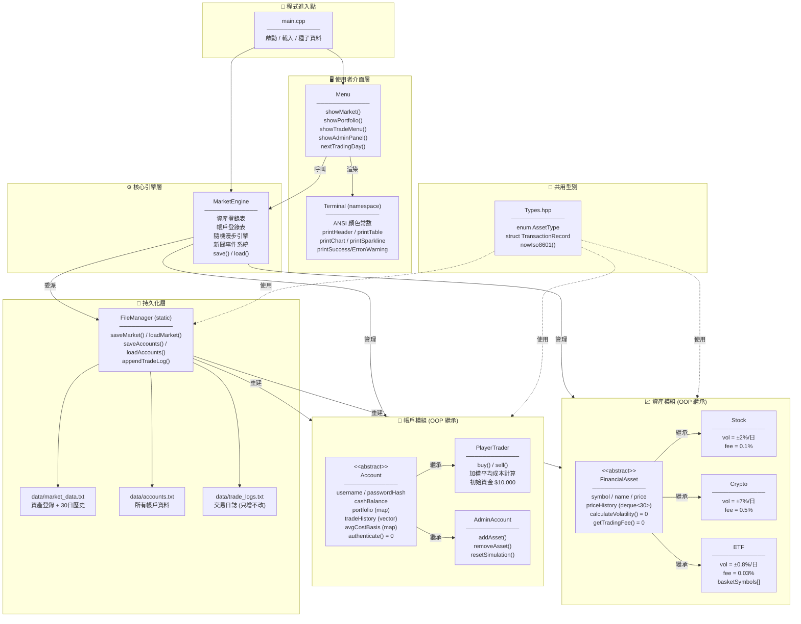
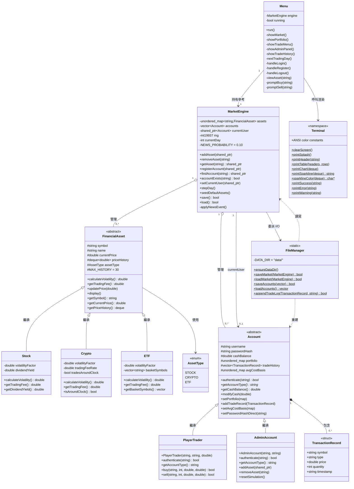
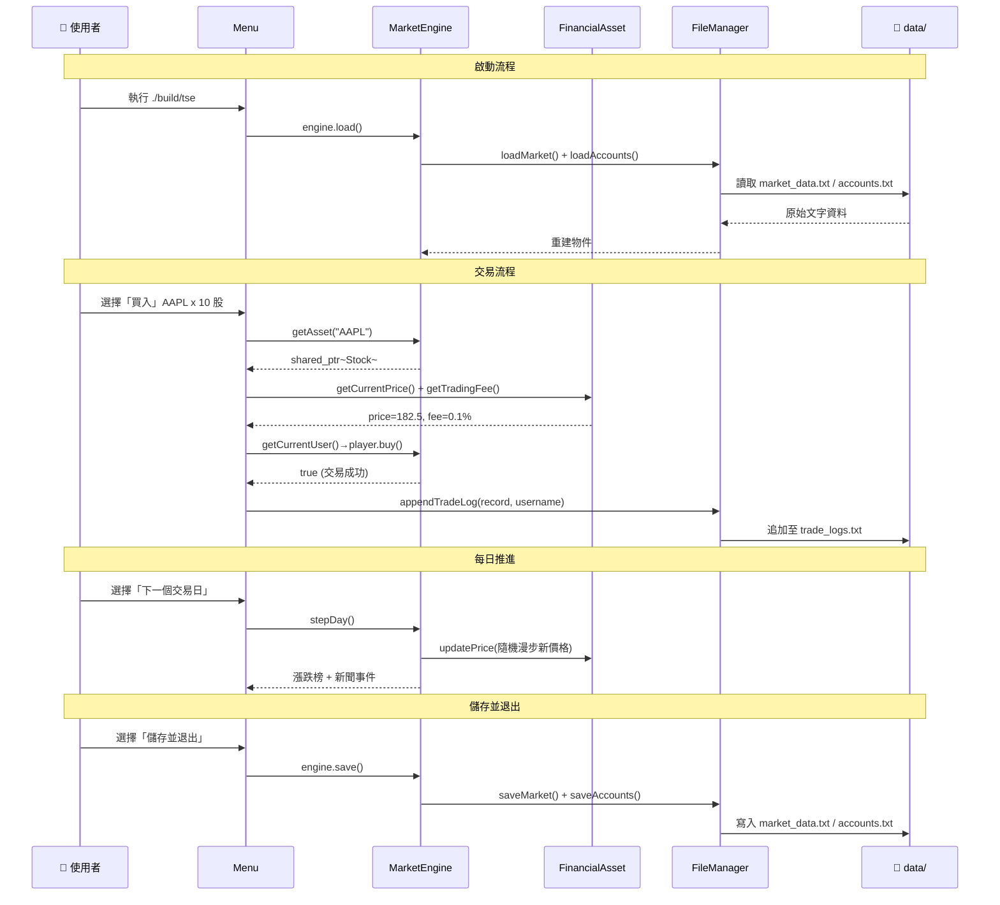
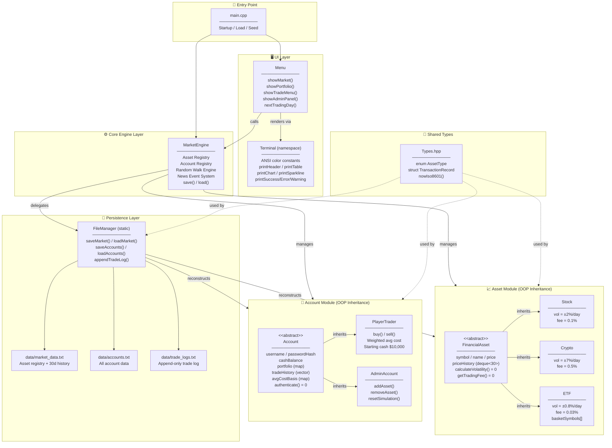
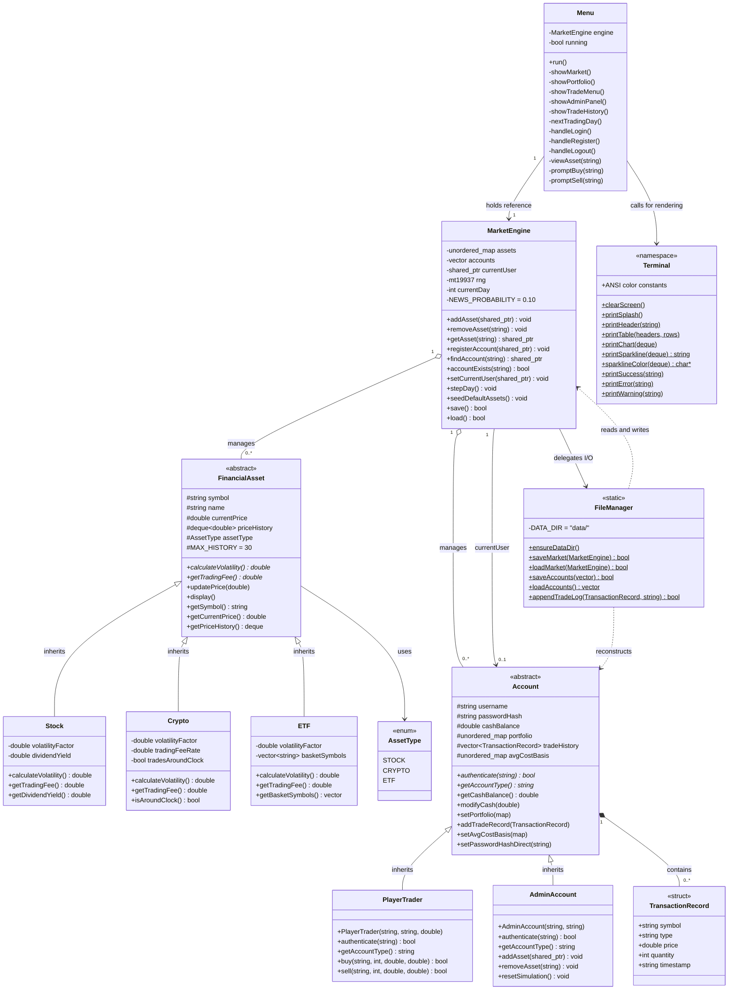

# 終端股票交易所 (TSE) — Terminal Stock Exchange

> 一個以 C++17 實作的互動式終端股票交易所模擬系統

---

## 目錄 / Table of Contents

- [中文說明](#中文說明)
- [English Documentation](#english-documentation)

---

# 中文說明

## 專案簡介

**終端股票交易所 (Terminal Stock Exchange, TSE)** 是一套完全在終端機中執行的股票交易模擬平台，使用純 **C++17** 開發，不依賴任何第三方函式庫。系統透過 ANSI 顏色代碼與 ASCII 製圖，呈現豐富的視覺化介面。

### 主要功能

| 功能 | 描述 |
|------|------|
| 🏦 多帳戶系統 | 支援普通交易者 (`PlayerTrader`) 與管理員 (`AdminAccount`) 兩種帳戶類型 |
| 📈 三種資產類型 | 股票 (Stock)、加密貨幣 (Crypto)、ETF — 各有不同波動率與手續費 |
| 🎲 隨機市場引擎 | 每日以常態分布隨機漫步更新資產價格，偶發新聞事件觸發大漲/大跌 |
| 💼 投資組合追蹤 | 即時顯示持倉數量、加權平均成本、損益 (P&L) |
| 📊 價格走勢圖 | 30 天歷史 ASCII 折線圖 + UTF-8 迷你走勢圖 (▁▂▃▄▅▆▇█) |
| 💾 全狀態持久化 | 遊戲進度儲存至 `data/` 資料夾，下次啟動自動還原 |
| 📰 新聞事件系統 | 每日 10% 機率觸發隨機市場新聞，影響資產價格 ±15%~40% |
| 🔒 帳戶認證 | 密碼雜湊儲存，支援帳戶登入/登出/註冊 |

---

## 快速開始 ⚡

### 系統需求

- macOS 或 Linux
- C++17 相容編譯器 (Clang ≥ 10 / GCC ≥ 9)
- CMake ≥ 3.16

### 編譯與執行

```bash
# 1. 進入專案目錄
cd /path/to/Terminal-Stock-Exchange

# 2. 編譯 (首次或程式碼修改後執行)
cmake -B build && cmake --build build

# 3. 執行
./build/tse
```

### 重置到乾淨狀態

```bash
rm -rf data/
./build/tse
```

---

## 系統架構圖



---

## 類別關係圖 (Class Diagram)



---

## 資料流程圖



---

## 專案檔案結構

```
Terminal-Stock-Exchange/
├── CMakeLists.txt              # 建置設定 (C++17, -Wall -Wextra -O2)
├── README.md                   # 本文件
├── data/                       # 執行時自動產生 (gitignored)
│   ├── market_data.txt         # 資產登錄 + 30日價格歷史
│   ├── accounts.txt            # 所有帳戶資料
│   └── trade_logs.txt          # 交易日誌 (只增不改)
└── src/
    ├── main.cpp                # 程式進入點
    ├── types/
    │   └── Types.hpp           # 共用型別 (AssetType, TransactionRecord)
    ├── assets/
    │   ├── FinancialAsset.hpp  # 抽象基底類別
    │   ├── Stock.hpp/.cpp      # 股票 (vol ±2%/日)
    │   ├── Crypto.hpp/.cpp     # 加密貨幣 (vol ±7%/日)
    │   └── ETF.hpp/.cpp        # ETF (vol ±0.8%/日)
    ├── accounts/
    │   ├── Account.hpp         # 帳戶抽象基底類別
    │   ├── PlayerTrader.hpp/.cpp   # 一般交易者
    │   └── AdminAccount.hpp/.cpp   # 管理員帳戶
    ├── engine/
    │   └── MarketEngine.hpp/.cpp   # 核心模擬引擎
    ├── io/
    │   └── FileManager.hpp/.cpp    # 靜態 I/O 服務
    └── ui/
        ├── Terminal.hpp/.cpp   # ANSI 渲染工具
        └── Menu.hpp/.cpp       # 互動式選單迴圈
```

---

## OOP 設計原則

| 原則 | 實作方式 |
|------|----------|
| **繼承** | `FinancialAsset` → `Stock` / `Crypto` / `ETF`；`Account` → `PlayerTrader` / `AdminAccount` |
| **多型** | `calculateVolatility()` 與 `getTradingFee()` 為純虛函式，各衍生類別有不同實作 |
| **封裝** | 所有資料成員皆為 `private`/`protected`，透過公開方法存取 |
| **抽象** | `FinancialAsset` 與 `Account` 均為抽象類別，無法直接實例化 |
| **STL 應用** | `std::deque`、`std::unordered_map`、`std::vector`、`std::shared_ptr`、`std::mt19937` |

---

---

# English Documentation

## Project Overview

**Terminal Stock Exchange (TSE)** is a fully interactive stock trading simulation that runs entirely in your terminal. Built with pure **C++17** and zero external dependencies, it demonstrates core Object-Oriented Programming principles — inheritance, polymorphism, encapsulation, and abstraction — alongside practical STL usage and file-based persistence.

### Key Features

| Feature | Description |
|---------|-------------|
| 🏦 Multi-Account System | Supports `PlayerTrader` and `AdminAccount` account types via inheritance |
| 📈 Three Asset Types | Stocks, Cryptocurrencies, and ETFs — each with distinct volatility and fee rates |
| 🎲 Random Market Engine | Daily Gaussian random-walk price updates with probabilistic news events |
| 💼 Portfolio Tracking | Real-time P&L with weighted-average cost basis per position |
| 📊 Price Charts | 30-day ASCII line chart + UTF-8 sparklines (▁▂▃▄▅▆▇█) |
| 💾 Full Persistence | Game state saved to `data/`, restored automatically on next launch |
| 📰 News Event System | 10% daily chance of a market-moving news event (±15–40% price shock) |
| 🔒 Account Auth | Password-hashed login, logout, and registration |

---

## Quick Start ⚡

### Prerequisites

- macOS or Linux
- C++17-compatible compiler (Clang ≥ 10 / GCC ≥ 9)
- CMake ≥ 3.16

### Build & Run

```bash
# 1. Navigate to the project root
cd /path/to/Terminal-Stock-Exchange

# 2. Build (first time, or after any code change)
cmake -B build && cmake --build build

# 3. Launch
./build/tse
```

> **Incremental rebuild** (faster after small changes):
> ```bash
> cmake --build build
> ```

### Reset to a Clean State

```bash
rm -rf data/
./build/tse
```

Deletes all saved accounts, portfolios, and price history. The app re-seeds 10 default assets on the next launch.

---

## How to Test / Play

### 1. First Launch
The splash screen appears. You will be prompted to **Login** or **Register**.

### 2. Create an Account
- Select `2` — Register
- Choose a username and password
- You start with **$10,000 USD** in cash
- You are automatically logged in after registration

### 3. View the Market
- Select `1` — View Market
- See all 10 listed assets (Stocks, ETFs, Crypto) with live sparkline trends and current prices

### 4. Trade Assets
- Select `3` — Trade
- Enter a ticker symbol (e.g. `AAPL`, `BTC`, `SPY`)
- View the asset detail panel with full price chart
- Choose **Buy** or **Sell**, enter a quantity
- Transaction fees are applied automatically

### 5. Advance Trading Days
- Select `4` — Next Trading Day
- Prices update via random walk, a news event may fire
- View the daily gainers and losers summary

### 6. Check Your Portfolio
- Select `2` — My Portfolio
- Displays quantity held, average cost, current value, and colour-coded P&L

### 7. View Trade History
- Select `7` — Trade History
- Timestamped log of every buy/sell you have executed

### 8. Admin Mode
- Log in as `admin` / `admin`
- Access option `5` — Admin Panel
- Add or remove assets from the exchange

### 9. Save & Quit
- Select `0` — Save & Quit
- All data is written to `data/`; your state is fully restored on the next run

---

## System Architecture



---

## Class Relationship Diagram



---

## Project File Structure

```
Terminal-Stock-Exchange/
├── CMakeLists.txt              # Build config (C++17, -Wall -Wextra -O2)
├── README.md                   # This file
├── data/                       # Auto-generated at runtime (gitignored)
│   ├── market_data.txt         # Asset registry + 30-day price history
│   ├── accounts.txt            # All account data (pipe-delimited)
│   └── trade_logs.txt          # Append-only trade log (ISO-8601 timestamps)
└── src/
    ├── main.cpp                # Entry point
    ├── types/
    │   └── Types.hpp           # Shared types (AssetType enum, TransactionRecord struct)
    ├── assets/
    │   ├── FinancialAsset.hpp  # Abstract base class (pure virtual interface)
    │   ├── Stock.hpp/.cpp      # Equities (vol ±2%/day, fee 0.1%)
    │   ├── Crypto.hpp/.cpp     # Cryptocurrency (vol ±7%/day, fee 0.5%)
    │   └── ETF.hpp/.cpp        # ETF (vol ±0.8%/day, fee 0.03%, basket)
    ├── accounts/
    │   ├── Account.hpp         # Abstract base class for all accounts
    │   ├── PlayerTrader.hpp/.cpp   # Human trader (buy/sell, cost basis)
    │   └── AdminAccount.hpp/.cpp   # Admin (add/remove assets, reset)
    ├── engine/
    │   └── MarketEngine.hpp/.cpp   # Central simulation engine
    ├── io/
    │   └── FileManager.hpp/.cpp    # Static-only file I/O service
    └── ui/
        ├── Terminal.hpp/.cpp   # ANSI rendering utilities (namespace)
        └── Menu.hpp/.cpp       # Interactive menu loop and sub-menus
```

---

## OOP Principles Demonstrated

| Principle | Implementation |
|-----------|---------------|
| **Inheritance** | `FinancialAsset` → `Stock` / `Crypto` / `ETF`; `Account` → `PlayerTrader` / `AdminAccount` |
| **Polymorphism** | `calculateVolatility()` and `getTradingFee()` are pure-virtual; each subclass overrides with its own rate |
| **Encapsulation** | All data members are `private`/`protected`; access is controlled via public getters/setters |
| **Abstraction** | Both `FinancialAsset` and `Account` are abstract classes — they cannot be instantiated directly |
| **STL Usage** | `std::deque`, `std::unordered_map`, `std::vector`, `std::shared_ptr`, `std::mt19937` |

---

## Default Assets

| Ticker | Name | Type | Starting Price | Volatility | Fee |
|--------|------|------|---------------|------------|-----|
| AAPL | Apple Inc. | Stock | $182.50 | ±2%/day | 0.1% |
| MSFT | Microsoft Corp. | Stock | $374.20 | ±2%/day | 0.1% |
| GOOGL | Alphabet Inc. | Stock | $140.10 | ±2%/day | 0.1% |
| TSLA | Tesla Inc. | Stock | $245.80 | ±3%/day | 0.1% |
| NVDA | NVIDIA Corp. | Stock | $495.30 | ±3%/day | 0.1% |
| SPY | S&P 500 ETF | ETF | $452.10 | ±0.8%/day | 0.03% |
| QQQ | Nasdaq-100 ETF | ETF | $378.60 | ±0.8%/day | 0.03% |
| BTC | Bitcoin | Crypto | $43,250.00 | ±7%/day | 0.5% |
| ETH | Ethereum | Crypto | $2,285.00 | ±7%/day | 0.5% |
| SOL | Solana | Crypto | $98.40 | ±7%/day | 0.5% |

---

## Technical Notes

- **Password Storage**: Passwords are stored as `std::hash<std::string>` hashes. This is sufficient for a simulation; a production system would use bcrypt or Argon2.
- **File Format**: All data files use pipe-delimited (`|`) plain text for easy inspection and debugging.
- **No External Dependencies**: Pure C++17 STL — no Boost, ncurses, OpenSSL, or any third-party libraries.
- **Compiler**: Tested on Apple Clang 21.0.0 (arm64-apple-darwin).
- **Concurrency**: Single-threaded; the simulation is fully deterministic except for seeded PRNG.

---

*Built as a C++ OOP coursework project demonstrating inheritance, polymorphism, STL containers, file persistence, and ANSI terminal rendering.*
